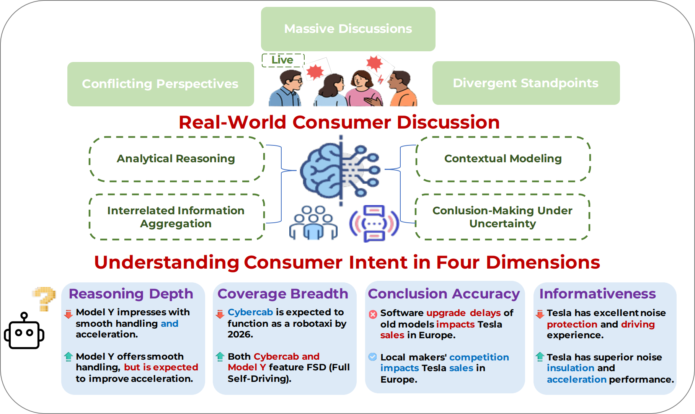

# COINBench: Moving Beyond Individual Perspectives to Collective Intent Understanding

 

## 📣 What's New
- **[2025.10.15]** We have released ConsintBench in [OliverLeeXZ/ConsintBench](https://github.com/OliverLeeXZ/ConsintBench). 🎉🎉🎉
<!-- - **[2025.10.13]** We have released model checkpoint in [OliverLee/Qwen2.5-7B-NP](https://huggingface.co/OliverLee/Qwen2.5-7B-NP). 🎉🎉🎉 -->
<!-- - **[2025.6.10]** Our OPT-BENCH Paper is released! Check it at 📃[Arxiv: OPT-BENCH](http://arxiv.org/abs/2506.10764) ! Our Dataset will be open-sourced soon! 🎉🎉🎉 -->

## 👨‍💻 Todo List

- ✅ Paper Release
- ⏳ ConsintBench Release [*Coming Soon*]

## 🏆 ConsintBench Leaderboard
## Performance of reasoning LLMs, general LLMs, and open-source LLMs on \bench, with the best performance highlighted in **bold**.

| **Model**                | **Depth L1** | **Depth L2** | **Depth L3** | **Depth L4** | **Depth L5** | **Depth Overall** | **Breadth** | **Informativeness Lexical** | **Informativeness Semantic↓** | **Correctness** |
|--------------------------|--------------|--------------|--------------|--------------|--------------|-------------------|-------------|----------------------------|--------------------------------|-----------------|
| **Proprietary LLMs**      |              |              |              |              |              |                   |             |                            |                                |                 |
| GPT-5                    | 18.29        | **25.81**     | **6.25**      | **3.49**      | 0.06         | 10.78             | **53.48**   | 80.21                      | 62.75                          | 62.65           |
| GPT-4.1                  | 20.97        | 25.03        | 5.90          | 3.37          | 0            | 11.01             | 53.41       | 79.07                      | 63.82                          | 59.05           |
| GPT-4o                   | 20.99        | 23.70        | 4.90          | 2.58          | 0.05         | 10.44             | 52.95       | 79.56                      | 62.86                          | 75.75           |
| Claude-3.5-sonnet        | 19.25        | 23.25        | 5.34          | 2.95          | 0            | 10.16             | 52.83       | 73.94                      | 61.11                          | 53.35           |
| GPT-o3                   | 16.17        | 22.43        | 5.69          | 3.18          | **0.07**     | 9.51              | 52.73       | **85.52**                  | **52.27**                      | **80.35**       |
| **Open-Source LLMs**      |              |              |              |              |              |                   |             |                            |                                |                 |
| Qwen3-30B-A3B            | **25.01**     | 23.66        | 5.43          | 2.51          | 0.06         | **11.33**         | 53.20       | 70.58                      | 68.94                          | 61.60           |
| DS-Distill-Qwen-14B      | 17.00        | 25.56        | 6.12          | 3.30          | 0            | 10.40             | 53.32       | 67.47                      | 75.53                          | 58.45           |
| Qwen2.5-32B-Instrcut     | 19.26        | 23.63        | 5.31          | 2.89          | 0.01         | 10.21             | 52.46       | 65.72                      | 74.60                          | 54.95           |
| Qwen3-32B                | 20.77        | 23.46        | 5.57          | 2.82          | 0            | 10.52             | 51.15       | 65.84                      | 68.16                          | 55.26           |
| Qwen3-8B                 | 15.95        | 22.43        | 4.89          | 2.39          | 0.01         | 9.13              | 50.58       | 57.51                      | **81.25**                       | 50.42           |
| Qwen2.5-72B-Instrcut     | 18.89        | 22.27        | 5.73          | 3.10          | 0            | 10.00             | 50.52       | 54.63                      | 77.49                          | 64.11           |
| DS-Distill-Qwen-32B      | 16.60        | 24.56        | 5.90          | 3.30          | 0            | 10.07             | 50.34       | 59.30                      | 76.58                          | 53.90           |
| Qwen2.5-14B-Instrcut     | 13.56        | 22.23        | 5.45          | 2.87          | 0.02         | 8.83              | 48.27       | 52.39                      | 80.06                          | 60.88           |
| LLama3.2-8B-Instrcut    | 13.88        | 19.75        | 5.62          | 2.73          | 0            | 8.40              | 47.91       | 47.87                      | **88.25**                       | 52.31           |
| Qwen2.5-7B-Instrcut     | 11.87        | 19.73        | 4.16          | 1.97          | 0            | 7.54              | 47.43       | 43.58                      | 85.07                          | 49.24           |
| Internlm3-8B-Instrcut   | 11.07        | 20.76        | 4.87          | 2.61          | 0.03         | 7.87              | 45.91       | 49.83                      | 75.51                          | 51.67           |
| LLama3.1-8B-Instrcut    | 11.23        | 19.46        | 5.53          | 2.91          | 0            | 7.83              | 45.41       | 42.36                      | **88.00**                       | 52.67           |
| Qwen2.5-3B-Instrcut     | 13.49        | 18.63        | 4.22          | 2.09          | 0            | 7.69              | 42.73       | 39.32                      | 79.35                          | 35.43           |
| Qwen2.5-1.5B-Instrcut   | 2.83         | 4.94         | 0.99          | 0.45          | 0            | 1.84              | 14.31       | 4.56                       | 87.65                          | 36.90           |
| DS-Distill-Qwen-7B      | 1.80         | 4.91         | 1.35          | 0.55          | 0            | 1.72              | 11.54       | 3.30                       | 73.25                          | 13.40           |